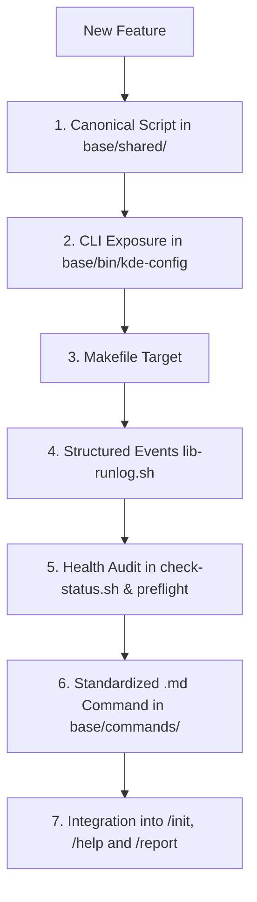

# Architecture & Engineering Discipline — Linux Wayland Suite
This document defines the **Development Constitution** of the suite. No new feature, script, or fix may be added in isolation. Every addition to the repository must be integrated across **7 mandatory layers**.

---

## 1. The 7 Mandatory Pillars of Any New Feature

When designing and implementing any new capability (e.g. new keyboard driver, hardware control, power management, display profile), the following checklist is **mandatory**:



### Pillar 1: Canonical Script (`base/shared/<name>.sh` or `.py`)
- **Location:** Exclusively in `base/shared/`.
- **Minimum Required Interface:**
  - `--apply` (or direct action): applies configuration with atomic pre-execution backup.
  - `--revert` (or `--remove`): reverts changes and restores backup/default.
  - `--status`: displays current feature state.
- **Fault Tolerance:** Usage of `set -euo pipefail`, dependency validation, and root protection checks.

### Pillar 2: CLI Orchestrator (`base/bin/kde-config`)
- Mapped in `usage()` function.
- Dedicated helper function `cmd_<name>()`.
- Routed in `dispatch()`.
- Execution logging support via `~/.local/state/kde-wayland-suite/runs/`.

### Pillar 3: Build & Automation (`Makefile`)
- Add target name to `.PHONY`.
- Document in `make help` output.
- Create forwarding rule:
  ```makefile
  <name>:
  	@./bin/kde-config <name>
  ```

### Pillar 4: Structured Events (`lib-runlog.sh`)
- Every script must include:
  ```bash
  if [ -f "$SCRIPT_DIR/lib-runlog.sh" ]; then
      source "$SCRIPT_DIR/lib-runlog.sh"
  else
      runlog_event() { :; }
      runlog_metric() { :; }
  fi
  ```
- Emit atomic event records via `runlog_event <status> <id> [detail]` (`status` ∈ `ok`, `warn`, `fail`, `skip`, `info`, `metric`).

### Pillar 5: Continuous Health Audit (`check-status.sh` and `preflight-base.sh`)
- `check-status.sh` must audit the new feature automatically:
  - Compliant: emit `[OK]` + `runlog_event "ok" ...`.
  - Non-compliant or requiring action: emit `[WARN]` indicating the exact 1-line command to fix + `runlog_event "warn" ...`.

### Pillar 6: Standardized AI Command (`base/commands/<name>.md`)
- Document with YAML frontmatter (`description:`), header `# /<name>`, and:
  1. **Guided Interactive Workflow:** Explicit instruction for AI agents to use `AskUserQuestion` (or `ask`) before applying risky or multi-choice options.
  2. **Evidence-First Verdict Output Contract:** Complete replication of `OUTPUT-CONTRACT.md`.
- **Relative Symlinks:** Mirrored via relative symlinks into `claude-code/commands/`, `cursor/commands/`, `omp/commands/`, and `antigravity/skills/`.

### Pillar 7: Central `/help` and Recommended Actions in `/report`
- **`/help`:** Insert corresponding row in the command matrix of `base/commands/help.md`.
- **`report.sh`:** Register `warn`/`fail` event mapping so reports display the exact 1-line fix in `Recommended Actions`.

---

## 2. The 6 Inviolable Architectural Rules

1. **Single Canonical Source (`base/`):**
   - Never create duplicate physical files in `claude-code/`, `cursor/`, `omp/`, `antigravity/`, or root.
   - All platform integration directories use relative symlinks pointing to `base/commands/`, `base/shared/`, and `base/skills/`.
2. **Evidence-First Verdict Output Contract (`OUTPUT-CONTRACT.md`):**
   - Every command executed by any AI agent must strictly report using the evidence-first verdict format:
     * `### 🎯 Verdict: [ ✅ SUCCESS | ❌ FAILURE | ⚠️ PARTIAL SUCCESS ]`
     * `#### 📋 Execution Breakdown` (`✅ Applied`, `❌ Failure/Rejection with raw error & root cause`, `🔒 Manual Root Action`)
     * `#### 🔬 Technical Evidence & Ground Truth` (Table: Component, Verified State, Observable Proof/Command, How to Revert)
     * `#### 💡 Daily Impact & Practical Benefits`
     * `#### 👉 Action Required` (Direct copy-paste command without sudo prefix)
3. **Structured Data Consumption (`events.tsv`):**
   - AI agents and reporting engines must read `events.tsv`, never parse ANSI color escape codes from terminal logs.
4. **AI Host & Language Profile Alignment (`lib-harness.sh`):**
   - Automatic recognition of OMP, Claude Code, Cursor, Antigravity, and OpenCode.
   - Language preference persistence (`en` default, `pt-BR`) in `~/.config/linux-wayland-suite/harness-profile.json`.
   - Internal codebase, contracts, and runlogs remain canonical English; the AI translates user dialogues as requested.
5. **Release & Marketplace Discipline:**
   - Every release requires: semantic version bump (`package.json`, `.claude-plugin/`, `.omp-plugin/`, `antigravity/`), semantic commit (`feat(...)`, `fix(...)`), git push, and marketplace upgrade (`omp plugin upgrade ...`).
