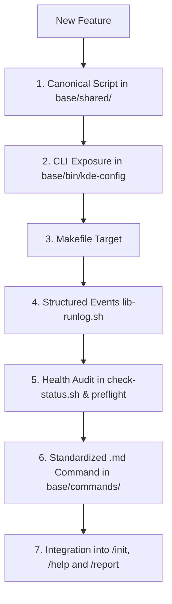

# Architecture & Engineering Discipline — Linux Wayland Suite
This document defines the **Development Constitution** of the suite. No new feature, script, or fix may be added in isolation. Every addition to the repository must be integrated across **7 mandatory layers**.

---

## 1. The 7 Mandatory Pillars of Any New Feature

When designing and implementing any new capability (e.g. new keyboard driver, hardware control, power management, display profile), the following checklist is **mandatory**:



### Pillar 1: Canonical Script (`base/shared/<name>.sh` or `.py`)
- **Location:** Exclusively in `base/shared/`.
- **Minimum Required Interface:**
  - `--apply` (or direct action): applies configuration with atomic pre-execution backup.
  - `--revert` (or `--remove`): reverts changes and restores backup/default.
  - `--status`: displays current feature state.
- **Fault Tolerance:** Usage of `set -euo pipefail`, dependency validation, and root protection checks.

### Pillar 2: CLI Orchestrator (`base/bin/kde-config` / `linux-wayland-config`)
- Mapped in `usage()` function.
- Dedicated helper function `cmd_<name>()`.
- Routed in `dispatch()`.
- Execution logging support via `~/.local/state/kde-wayland-suite/runs/`.
- **Interactive Default Portal (`portal_menu.py`):** When `linux-wayland-config` is invoked with zero arguments in an interactive terminal (`[ -t 0 ]`), it launches `portal_menu.py` (Central Control Portal), displaying the real-time system context card (hardware, layout, power, cedilla) and rich module descriptions. In non-interactive pipelines or subshells, it safely falls back to `status`.
### Pillar 3: Build & Automation (`Makefile`)
- Add target name to `.PHONY`.
- Document in `make help` output.
- Create forwarding rule:
  ```makefile
  <name>:
  	@./bin/kde-config <name>
  ```

### Pillar 4: Structured Events (`lib-runlog.sh`)
- Every script must include:
  ```bash
  if [ -f "$SCRIPT_DIR/lib-runlog.sh" ]; then
      source "$SCRIPT_DIR/lib-runlog.sh"
  else
      runlog_event() { :; }
      runlog_metric() { :; }
  fi
  ```
- Emit atomic event records via `runlog_event <status> <id> [detail]` (`status` ∈ `ok`, `warn`, `fail`, `skip`, `info`, `metric`).

### Pillar 5: Continuous Health Audit (`check-status.sh` and `preflight-base.sh`)
- `check-status.sh` must audit the new feature automatically:
  - Compliant: emit `[OK]` + `runlog_event "ok" ...`.
  - Non-compliant or requiring action: emit `[WARN]` indicating the exact 1-line command to fix + `runlog_event "warn" ...`.

### Pillar 6: Standardized AI Command (`base/commands/<name>.md`)
- Document with YAML frontmatter (`description:`), header `# /<name>`, and:
  1. **Guided Interactive Workflow:** Explicit instruction for AI agents to use `AskUserQuestion` (or `ask`) before applying risky or multi-choice options.
  2. **Evidence-First Verdict Output Contract:** Complete replication of `OUTPUT-CONTRACT.md`.
- **Relative Symlinks:** Mirrored via relative symlinks into `claude-code/commands/`, `cursor/commands/`, `omp/commands/`, and `antigravity/skills/`.

### Pillar 7: Central `/help`, `/report` and Documentation Synchronization
- **`/help`:** Insert corresponding row in the command matrix of `base/commands/help.md`.
- **`report.sh`:** Register `warn`/`fail` event mapping so reports display the exact 1-line fix in `Recommended Actions`.
- **`README.md` & `README.pt-BR.md`:** Synchronize feature description and CLI reference table across both languages.
---

## 2. The 10 Inviolable Architectural Rules

1. **Single Canonical Source (`base/`):**
   - Never create duplicate physical files in `claude-code/`, `cursor/`, `omp/`, `antigravity/`, or root.
   - All platform integration directories use relative symlinks pointing to `base/commands/`, `base/shared/`, and `base/skills/`.
2. **Evidence-First Verdict Output Contract (`OUTPUT-CONTRACT.md`):**
   - Every command executed by any AI agent must strictly report using the evidence-first verdict format:
     * `### 🎯 Verdict: [ ✅ SUCCESS | ❌ FAILURE | ⚠️ PARTIAL SUCCESS ]`
     * `#### 📋 Execution Breakdown` (`✅ Applied`, `❌ Failure/Rejection with raw error & root cause`, `🔒 Manual Root Action`)
     * `#### 🔬 Technical Evidence & Ground Truth` (Table: Component, Verified State, Observable Proof/Command, How to Revert)
     * `#### 🏛️ 7-Pillars Architectural Compliance Gate` (Mandatory table proving compliance across all 7 layers before yielding)
     * `#### 💡 Daily Impact & Practical Benefits`
     * `#### 👉 Action Required` (Direct copy-paste command without sudo prefix)
   - **Pre-Delivery Gate Enforcement:** No AI agent or developer may declare a feature delivery complete without the explicit 7-Pillars compliance table. Deliveries omitting this verification are strictly rejected.
3. **Structured Data Consumption (`events.tsv`):**
   - AI agents and reporting engines must read `events.tsv`, never parse ANSI color escape codes from terminal logs.
4. **AI Host & Language Profile Alignment (`lib-harness.sh`):**
   - Automatic recognition of OMP, Claude Code, Cursor, Antigravity, and OpenCode.
   - Language preference persistence (`en` default, `pt-BR`) in `~/.config/linux-wayland-suite/harness-profile.json`.
   - Internal codebase, contracts, and runlogs remain canonical English; the AI translates user dialogues as requested.
5. **Release & Marketplace Discipline:**
   - **Exhaustive Version Bump Checklist:** Every release strictly requires bumping the semantic version (`X.Y.Z`) across **all 11 manifest and documentation files**:
     1. `package.json` (`"version": "X.Y.Z"`)
     2. `.claude-plugin/plugin.json` (`"version": "X.Y.Z"`)
     3. `.claude-plugin/marketplace.json` (`plugins[].version = "X.Y.Z"`)
     4. `.omp-plugin/plugin.json` (`"version": "X.Y.Z"`)
     5. `.omp-plugin/marketplace.json` (`plugins[].version = "X.Y.Z"`)
     6. `claude-code/.claude-plugin/plugin.json` (`"version": "X.Y.Z"`)
     7. `omp/.claude-plugin/plugin.json` (`"version": "X.Y.Z"`)
     8. `omp/.omp-plugin/plugin.json` (`"version": "X.Y.Z"`)
     9. `antigravity/plugin.json` (`"version": "X.Y.Z"`)
     10. `README.md` (Version badge: `[]`)
     11. `README.pt-BR.md` (Badge de versão: `[]`)
   - **Mandatory Verification Check:** Run `grep -rn '"version"' package.json */*.json .*/*/*.json` before committing to guarantee zero version drift across catalogs.
   - **Marketplace Sync:** After pushing to GitHub, immediately sync the local harness marketplace:
     ```bash
     omp plugin marketplace update linux-wayland-suite
     omp plugin upgrade linux-wayland-suite@linux-wayland-suite
     ```
6. **Mandatory Documentation Synchronization (README & Translations):**
   - Every new feature, command, or behavioral change must be documented simultaneously in both `README.md` (English) and `README.pt-BR.md` (Português do Brasil).
   - Must keep in sync: version badges (`Version-X.Y.Z`), the feature problem/solution section, and the CLI/Makefile command reference table.
   - A release or feature merge is strictly incomplete without synchronized dual-language documentation.
7. **Upstream Attribution & Open-Source Ethics:**
   - Whenever this suite adopts, wraps, or ports code, algorithms, byte patterns, patches, or research from external creators or community repositories:
     * **Code Integrity:** Keep the upstream script or module intact in its canonical form in `base/shared/` whenever possible, delegating orchestration to suite wrappers rather than rewriting.
     * **Multi-Layer Attribution:**
       1. **Script Headers:** Retain and explicitly declare author name, license, and upstream repository URL.
       2. **CLI & Terminal Output:** Banners and logs for the feature must display the author name and upstream URL.
       3. **AI Agent Commands (`commands/<name>.md`):** Include an explicit `## 👏 Upstream Attribution & Credits` section, and instruct AI agents in the Guided Flow to explain the origin of the fix to the user.
       4. **Documentation:** Synchronize attribution in both `README.md` and `README.pt-BR.md` in the feature description and under `## 👏 Acknowledgments & Upstream Credits`.
8. **Git Branching Conventions:**
   - All work in the repository must be developed on standardized topic branches before merging into `main`:
     * `feature/<slug>`: New capabilities, scripts, options, or hardware support (e.g. `feature/patch-cedilla`).
     * `fix/<slug>`: Bug fixes, hardware matrix repairs, shortcut patches, or regressions (e.g. `fix/fcitx5-system-autostart`).
     * `release/<version>`: Release staging, version bumps across manifests, and changelog updates (e.g. `release/v2.6.0`).
     * `chore/<slug>`: Tooling, marketplace catalogs, CI, or harness maintenance.
     * `docs/<slug>`: Documentation, translations, skill guides, or contract clarifications.
     * `refactor/<slug>`: Code restructuring without interface or behavioral changes.
   - **Main Branch Discipline:** The `main` branch represents tested, production-ready code. Direct chaotic commits are prohibited; merges into `main` must use semantic commit messages (`feat(...)`, `fix(...)`, `chore(...)`).
9. **Progressive Disclosure & Informed Consent (*Discover $\to$ Contextualize $\to$ Ask $\to$ Execute*):**
   - No destructive command, root action, or multi-target batch modification may execute blindly without informed user consent:
     * **Phase 1 (Silent Discovery):** Inspect the system, hardware, and filesystem non-destructively. Never ask the user what the computer can determine on its own.
     * **Phase 2 (Contextualization):** Present findings clearly. Explain the *what*, the *why*, and the *how to rollback* in 2–3 concise sentences before applying changes.
     * **Phase 3 (Consent & Scoping):** When actions carry tradeoffs, multiple targets, or require `sudo`, prompt the user with safe defaults (e.g. apply only to vulnerable targets, ask confirmation before installing persistence hooks).
     * **Phase 4 (Atomic Execution & Proof):** Execute changes with atomic backups (`.orig`), verify immediately, and report results using the Evidence-First Verdict contract.
     * **Central Portal Entrypoint:** The interactive portal (`linux-wayland-config menu`) embodies Progressive Disclosure by presenting real-time hardware context and clear explanations of every module before execution, allowing users to make informed decisions.
10. **Terminal Internationalization & Design Tokens (`i18n` & UI System):**
   - **Bilingual Terminal Output:** Scripts and terminal interfaces must consult `harness-profile.json` (or `KDE_SUITE_LANG`, fallback `en`) and present all headers, tables, prompts, and status messages in the user's configured language (`en` or `pt-BR`).
   - **Unified Design Tokens (Dracula/Garuda Palette):**
     * `PRIMARY` (`\033[1;36m` / Bold Cyan): Headers, banners, menu selection numbers.
     * `SUCCESS` (`\033[0;32m` / Green): Completed actions, active states (`[✔ OK]`, `[✔ PATCHED]`).
     * `DANGER` (`\033[0;31m` / Red): Hard failures, vulnerable items (`[✖ VULNERABLE]`).
     * `WARNING` (`\033[1;33m` / Bold Yellow): User attention items (`[⚠ WARNING]`).
     * `MUTED` (`\033[0;90m` / Gray): Long filesystem paths, secondary details.
     * `BORDER` (`\033[2;36m` / Dim Cyan): Unicode box borders and horizontal rules (`────`).
   - **Visible-Width Table Alignment:** Table formatters must calculate visible string width (stripping ANSI escapes) so columns remain mathematically aligned regardless of terminal size, colors, or UTF-8 accents.
