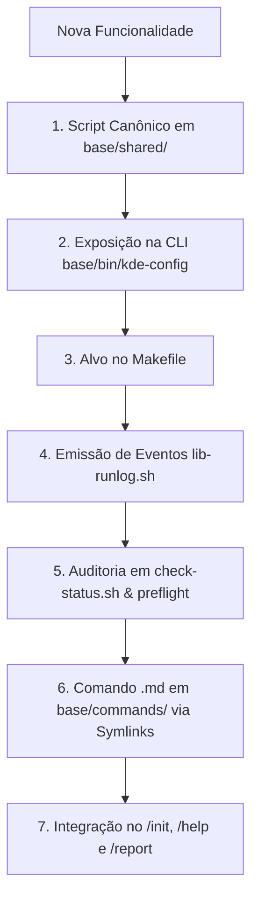

# Arquitetura e Disciplina de Engenharia — Linux Wayland Suite
Este documento define a **Constituição de Desenvolvimento** da suite. Nenhuma nova funcionalidade, script ou correção pode ser adicionada de forma isolada. Toda adição ao repositório deve nascer integrada em **7 camadas obrigatórias**.

---

## 1. Os 7 Pilares Obrigatórios de Qualquer Nova Funcionalidade

Ao planejar e implementar qualquer nova capacidade (ex.: novo driver de teclado, controle de hardware, gerenciamento de energia, perfis de display), o checklist abaixo é **mandatório**:



### Pilar 1: Script Canônico (`base/shared/<nome>.sh` ou `.py`)
- **Localização:** Exclusivamente em `base/shared/`.
- **Interface Mínima Obrigatória:**
  - `--apply` (ou ação direta): aplica a configuração com backup atômico prévio.
  - `--revert` (ou `--remove`): desfaz a alteração e restaura o backup/padrão.
  - `--status`: exibe o estado atual do recurso.
- **Tolerância a Falhas:** Uso de `set -euo pipefail`, validação de dependências e proteção de `sudo` com checagem de `$EUID`.

### Pilar 2: Orquestrador CLI (`base/bin/kde-config`)
- Mapeamento na função `usage()`.
- Função auxiliar dedicada `cmd_<nome>()`.
- Roteamento no `dispatch()`.
- Suporte a execução com captura de logs em `~/.local/state/kde-wayland-suite/runs/`.

### Pilar 3: Build & Automação (`Makefile`)
- Adicionar o nome do alvo ao `.PHONY`.
- Documentar na saída do `make help`.
- Criar a regra de encaminhamento:
  ```makefile
  <nome>:
  	@./bin/kde-config <nome>
  ```

### Pilar 4: Eventos Estruturados (`lib-runlog.sh`)
- Todo script deve incluir:
  ```bash
  if [ -f "$SCRIPT_DIR/lib-runlog.sh" ]; then
      source "$SCRIPT_DIR/lib-runlog.sh"
  else
      runlog_event() { :; }
      runlog_metric() { :; }
  fi
  ```
- Emitir registros atômicos via `runlog_event <status> <id> [detalhe]` (`status` ∈ `ok`, `warn`, `fail`, `skip`, `info`, `metric`).

### Pilar 5: Auditoria Contínua de Saúde (`check-status.sh` e `preflight-base.sh`)
- O `check-status.sh` deve auditar o novo recurso automaticamente:
  - Se estiver correto: emite `[OK]` + `runlog_event "ok" ...`.
  - Se estiver ausente ou precisar de ação: emite `[AVISO]` indicando o comando exato de 1 linha para ativar + `runlog_event "warn" ...`.

### Pilar 6: Comando de IA Padronizado (`base/commands/<nome>.md`)
- Documento com frontmatter YAML (`description:`), cabeçalho `# /<nome>` e:
  1. **Fluxo Guiado Interativo:** Instrução explícita para agentes de IA usarem `AskUserQuestion` (ou `ask`) antes de aplicar mudanças arriscadas ou multi-opções.
  2. **Contrato de Saída Tetra-Fásico:** Replicação integral do `OUTPUT-CONTRACT.md`.
- **Symlinks Relativos:** Replicado via symlinks relativos para `claude-code/commands/`, `cursor/commands/`, `omp/commands/` e `antigravity/skills/`.

### Pilar 7: Central `/help` e Ações Recomendadas no `/report`
- **`/help`:** Inserir a linha correspondente na tabela geral de comandos de `base/commands/help.md`.
- **`report.sh`:** Cadastrar o mapeamento do evento `warn`/`fail` para que o relatório exiba a linha na seção `Como resolver pontos não conformes (Ações Recomendadas):`.

---

## 2. As 5 Regras Arquiteturais Invioláveis

1. **Fonte Canônica Única (`base/`):**
   - Nunca crie arquivos físicos duplicados em `claude-code/`, `cursor/`, `omp/`, `antigravity/` ou na raiz.
   - Todas as pastas de integração utilizam symlinks relativos apontando para `base/commands/` e `base/shared/`.
2. **Contrato de Saída Tetra-Fásico (`OUTPUT-CONTRACT.md`):**
   - Todo comando executado por qualquer IA deve responder estritamente nas 4 fases:
     * `### 1. Plano` (Comando, Faz, Reversível)
     * `### 2. Execução` (`✅`, `⏭️`, `⚠️`, `❌`)
     * `### 3. Resumo` (Tabela com O que mudou, Backup, Relatório salvo, Como reverter, Requer)
     * `### 4. Ações Recomendadas` (Obrigatório se houver `⚠️` ou `❌`, com comando exato de 1 linha)
3. **Consumo de Dados Estruturados (`events.tsv`):**
   - IAs e relatórios devem ler `events.tsv`, nunca parsear strings ANSI do terminal.
4. **Detecção e Alinhamento de Host (`lib-harness.sh`):**
   - Reconhecimento automático de OMP, Claude Code, Cursor e Antigravity. Qualquer comando audita o alinhamento com `~/.config/kde-wayland-suite/harness-profile.json`.
5. **Disciplina de Release e Marketplace:**
   - Toda alteração exige: bump semântico de versão (`package.json`, `.claude-plugin/`, `.omp-plugin/`, `antigravity/`), commit semântico (`feat(...)`, `fix(...)`), push para `origin/main` e upgrade no marketplace (`omp plugin upgrade ...`).
